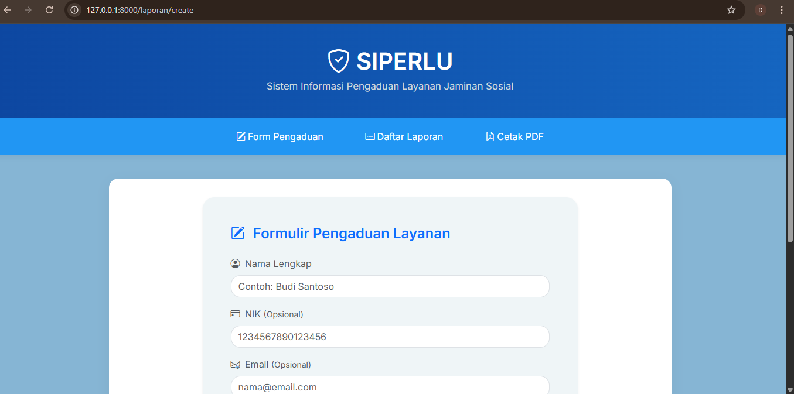
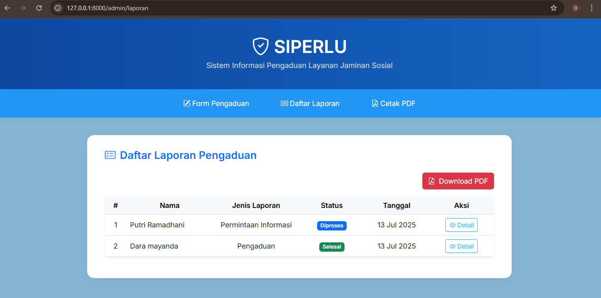
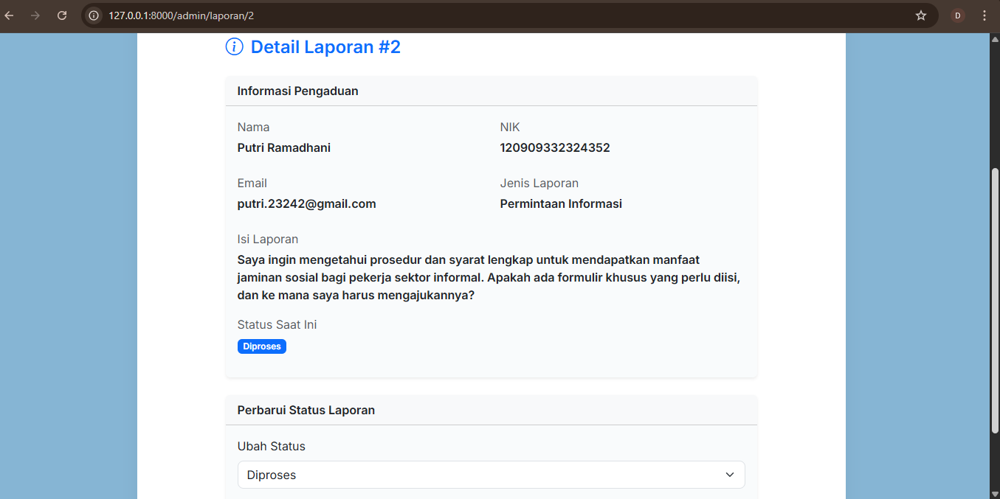

# SIPERLU – Sistem Pelayanan Terpadu Laporan Umum

SIPERLU adalah aplikasi web berbasis Laravel yang dirancang untuk mengelola pengaduan masyarakat secara digital, terstruktur, dan efisien. Aplikasi ini dibangun sebagai bentuk kontribusi terhadap transformasi digital layanan publik serta menjadi bagian dari portofolio pengembangan web untuk pengajuan magang, termasuk ke instansi seperti BPJS Ketenagakerjaan.

---

## ✨ Fitur Utama

- ✅ Formulir pengaduan masyarakat berbasis web  
- ✅ Validasi input & pelaporan status secara real-time  
- ✅ Panel admin untuk memantau dan mengelola laporan  
- ✅ Ekspor laporan dalam format PDF menggunakan DomPDF  
- ✅ Tampilan responsif & modern menggunakan Bootstrap 5  

---

## 🛠️ Teknologi yang Digunakan

- **Framework:** Laravel 9  
- **Frontend:** Blade + Bootstrap 5 + Bootstrap Icons  
- **Database:** MySQL  
- **PDF Generator:** DomPDF  

---

## 📁 Struktur Folder Penting

| Folder / File          | Keterangan                                      |
|------------------------|-------------------------------------------------|
| `/app`                 | Backend utama: Controller, Model, Middleware   |
| `/routes/web.php`      | Routing aplikasi                                |
| `/resources/views`     | Template tampilan Blade (HTML)                  |
| `/public`              | Aset publik (CSS, JS, icon, gambar)             |
| `composer.json`        | Daftar dependency Laravel                       |

---

## 📷 Tampilan Antarmuka

### 🔹 Formulir Pengaduan


### 🔹 Daftar Laporan


### 🔹 Detail Laporan



---

## 📌 Cara Menjalankan Proyek Ini

```bash
git clone https://github.com/DaraMayanda/siperlu-app.git
cd siperlu-app
composer install
cp .env.example .env
php artisan key:generate
php artisan migrate
php artisan serve
